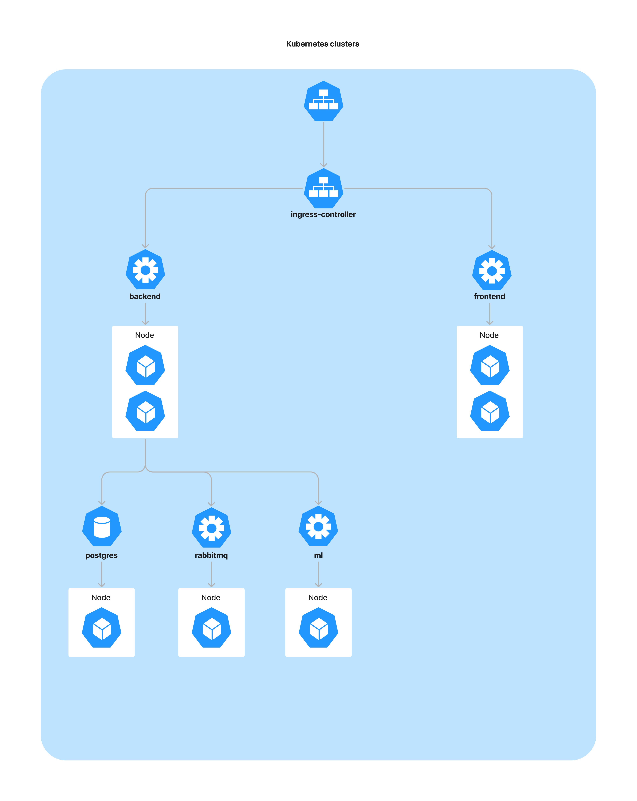

# OOP
# MAIGENERATION
Проект MAIGENERATION - сайт, где можно сгенерировать цитаты наподобие [Маевского цитатника](https://vk.com/maipassage) или текст, как в [ИА "Панорама МАИ"](https://vk.com/ia_panorama_mai). [Backend](maioop) написан на Java с помощью фреймворка Spring, [frontend](front) написан на React, так как генерация текста может занимать долгое время я использовал очередь сообщений RabbitMQ, сгенерированный текст сохраняется в БД (связь one-to-one). Чтобы сгенерировать текст нужно сначало авторизоваться, пользователь может посмотреть результат последнего запроса генерации текста. В качестве модели генерации текста взял [medium GPT3 от Сбера](https://huggingface.co/sberbank-ai/rugpt3medium_based_on_gpt2), дообучал в Colaboratory.     

## Архитектура
Точка входа в приложение ингресс-контроллер, доступ настроен по хосту maigeneration.ru.\
[Манифесты](manifests)


## Паттерны
  - ***Singleton***

Spring по умолчанию создает ровно один экземпляр объекта, к который можно получить с помощью аннотации\
Пример создание бина:
```Java
  @Repository
  public interface PostRepository extends JpaRepository<Posts, Long> {}
```
  Пример получения объекта:  
```Java
  @Autowired
  private PostRepository postRepository;
  ```
  - ***Dependency injection и inversion of control (IOC)***

IoC-контейнер в Spring, отвечает за создание объекта, связывание объектов вместе, конфигурирование объектов и обработку всего их жизненного цикла от создания до полного уничтожения.


В контейнере Spring используется инъекция зависимостей (Dependency Injection, DI) для управления компонентами приложения. Эти компоненты называются биныю
  - ***Builder***
```java
        User user = new User();
        user.setEmail(sign.email());
        user.setPassword(passwordEncode);
        user.setUsername(sign.name());
```

  - ***Chain of responsibility***

Запрос проходит цепочку обработки
```java
    @Bean
    public SecurityFilterChain filterChain(HttpSecurity httpSecurity) throws Exception {
        httpSecurity
        .cors().and().csrf().disable()
        .authorizeRequests()
        .antMatchers("/getLast/**").hasRole("USER")
        .antMatchers("/signout/**").hasRole("USER")
        .antMatchers("/generation/**").hasRole("USER")
        .and()
        .exceptionHandling().authenticationEntryPoint(unauthorizedHandler).and()
        .sessionManagement()
        .sessionCreationPolicy(SessionCreationPolicy.STATELESS);
        httpSecurity.headers().frameOptions().sameOrigin();
        httpSecurity.addFilterBefore(filter, UsernamePasswordAuthenticationFilter.class);
        return httpSecurity.build();
    }
```
  - ***Observer***

Следит за появление сообщений в очереди.
```java
    @RabbitListener(queues = "textQueue")
    public String[] listen(MyMessage message) throws URISyntaxException {
        ...
    }
```
  - ***Momento***

Сериализация сообщения
```java
    @PostMapping("/generation")
    public ResponseEntity<?> generate(@RequestBody GenerationModel model, Authentication authentication) throws URISyntaxException {
        UserDetailsImp userDetailsImp = (UserDetailsImp) authentication.getPrincipal();
        MyMessage message = new MyMessage(userDetailsImp.getId(), model.getCount(), List.of(new String[]{model.getText()}), model.getAuthor());
        String[] response = (String[]) rabbitTemplate.convertSendAndReceive(exchange.getName(), "rpc", message);
        return ResponseEntity.ok().body(response);
    }
```
Десериализация сообщения
```java
    @RabbitListener(queues = "textQueue")
    @Transactional
    public String[] listen(MyMessage message) throws URISyntaxException {
        ...
    }
```

### [Backend](maioop)
- [repositories](maioop/src/main/java/com/mai/maioop/repositories) содержат 3 интерефейса с помощью которых можно обращаться к БД: 
  - PostRepository
  - RoleRepository
  - UserRepository

- [services](maioop/src/main/java/com/mai/maioop/services) содержит служебные классы - сервисы, которые выполняют бизнес-логику
  - PostService
  - RoleService
  - UserService

- [contollers](maioop/src/main/java/com/mai/maioop/contollers) содержит контроллеры, обрабатывающие запросы.
    - AuthController
    - TextController

- [model](maioop/src/main/java/com/mai/maioop/model) содержит классы и рекорды, не реализующие никаких служебных интерфейсов сверх тех, которые нужны для бизнес-модели (нужны для получения, отправки запросов и сообщений)

- [filter](maioop/src/main/java/com/mai/maioop/filter) - пакет, в котором содержатся классы для настройки авторизации

- [entity](maioop/src/main/java/com/mai/maioop/entity) - пакет, в котором находятся сущности БД

- [security](maioop/src/main/java/com/mai/maioop/security) - пакет, в котором содержится реализация JWT токена и переопределение информация о пользователе 

- [configure](maioop/src/main/java/com/mai/maioop/configure) содержит конфигурацию приложения и очереди сообщений.

- [MaioopApplication](maioop/src/main/java/com/mai/maioop/MaioopApplication.java) - точка входа в приложение.

### [Нейронка](ServerML)
- [train](ServerML/train) содержит ноутбук с обучение и датасет, maipassage - текст в стиле [Маевского цитатника](https://vk.com/maipassage), panorama в стиле [ИА "Панорама МАИ"](https://vk.com/ia_panorama_mai)\
Идею взял из этой [статьи](https://habr.com/ru/company/sberbank/blog/528966/)
- [app](ServerML/app.py) простой сервер на фласке, обрабатывающий лишь один запрос - генерацию текста.

### [Frontend](front)

Использовал компоненты MaterialUI, есть несколько страниц: авторизация, регистрация, главная и страница с последним запросом
